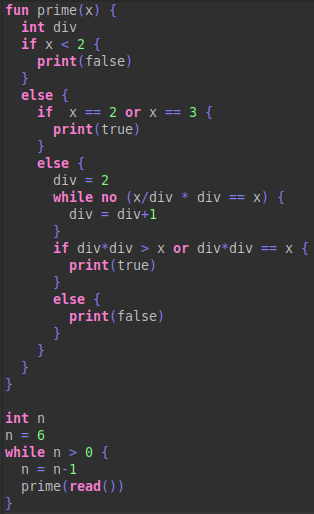

# TL-cbs
Small toy language that uses [CBS-beta](https://plancomps.github.io/CBS-beta/) for its specification, 
resembles an imperative language with modern insentive layout syntax.
[Notation summary](https://plancomps.github.io/CBS-beta/docs/Notation.html).

 

Features:

- [x] expresion evaluation, arithmetical and boolean
- [x] variable declaration, only integers
- [x] assignation, call by name in expresions
- [x] sequential execution
- [x] conditional execution (if else)
- [x] conditional repetition (while)
- [x] output of expreison evaluation 
- [x] function declaration
- [x] function call
- [x] inputs 
- [x] abrupted flow (returning)
- [x] variable declaration in function body 

Tested on:
* Ubuntu 22.04.1 LTS, with bash
* Window 10 Pro build 1904, with git-bash and mingw64

## Run
1. Download the corresponding executable: runfct-TL.exe for Windows, 
 runfct-TL for Unix-like or [build it](#markdown-header-Build-the-interpreter).
2. add its route that contains it to the path, refresh the enviromnet or open a new terminal.
3. open terminal
4.  go to tests project `cd TL-Test`

| Option               | Command line |
| --------------------- | --------------------------- |  
| All the tests: | `./run-tests.sh` |
| Only one file: | `./run-tests.sh -f TL-1/int.fct` |
| Or a folder: | `./run-tests.sh -f returning` |
| With output (writes .output and to std out):| `./run-tests.sh -c TL.config` |
| More options from [funcons-tools](https://hackage.haskell.org/package/funcons-tools-0.2.0.15/docs/Funcons-Tools.html):| `./run-tests.sh -c --auto-config false --interactive-mode true functions/read.fct` |
| Directly with interpreter: | `runfct-TL TL-2/if-stmt.fct` |

All the examples come with generated funcons (.fct) files, the to generate them follow the steps in the next section.

### Transformation
1. Download TL-Editor-<latest>.zip from the latest release
2. Extract it, the directory contains the project and comes with a version of Spoofax command line sunshine2
Use sunshine2 via TL-Tests/regen-tests.sh

| Option      | Command line |
| ----------- | -------------------------- |
| To funcons: | `./regen-funcons.sh` | 
| To aterms: | `./regen-funcons.sh -n "Show parsed AST"` |
| One file: | `./regen-funcons.sh -f TL-1/int.tl` |
| Or a forlder: | `./regen-funcons.sh -f functions` |

## Build the interpreter
Requisites: 
It's recommended to install them with [ghcup](https://www.haskell.org/ghcup/))
* ghc 9.2.8
* cabal 3.6.2.0
Steps:
1. extract funcons-TL-0.1.0.0.tar.gz
2. open terminal
3. `cd funcons-TL`
4. `cabal build`
5. `cabal install`
This install runfct-TL to `.cabal/bin` directory, add it to the path variable.

## Development (used in this language)
* spoofax 2.5.16 as eclipse built-in plugin whitout jre
* [jdk 1.8.0_265](https://github.com/AdoptOpenJDK/openjdk8-upstream-binaries/releases/tag/jdk8u265-b01)
* [CBS-beta at math](https://github.com/plancomps/CBS-beta/tree/math)
* cbs-beta-tools (ask to [PLanCompS](plancomps@gmail.com) or [to me](lmtapia1024@gmail.com))
* ghc 9.2.8
* cabal 3.6.2.0
* cbsc from [funcons-intgen](https://github.com/plancomps/funcons-intgen) package 
  * uu-cco from [van Binsbergen fork](https://github.com/ltbinsbe/uu-cco)
  * iml-tools from [van Binbergen's thesis](https://ltvanbinsbergen.nl/thesis/)

Follow [CBS-IDE User Guide](https://plancomps.github.io/cbs-ide/) for more detail about installation and use.

Extra notes:
- cbs-beta-tools: The cbs-latex branch was used instead of the prototype one 
- spoofax/eclipse.ini: 
  - add `-vm` option and the path to an installed jdk, as described in [eclipse's wiki](https://wiki.eclipse.org/Eclipse.ini#Specifying_the_JVM)
  - increase max memory to at least 4G as described [here](https://wiki.eclipse.org/Eclipse.ini#Specifying_the_JVM) 
- Update project following ´In case of Maven error´ from CBS-IDE User Guide.
- funcons-tools: use [version 0.2.0.15](https://hackage.haskell.org/package/funcons-tools-0.2.0.15) or later, runfct executable wasn't in previous releases
- iml-tools:  the same steps to build uu-cco apply.

	

